<div align="center">

# ⚡ MANGA AUTOMATION & AI INPAINTING SYSTEM v3.0 ⚡
### *Enterprise-Grade Manga Downloader, Management Dashboard & AI Text Erase Engine*

[](https://www.python.org/)
[](https://github.com/Rapptz/discord.py)
[](https://fastapi.tiangolo.com/)
[](https://pytorch.org/)
[](https://huggingface.co/)
[](LICENSE)

<br/>

> **نظام متكامل عالي الكفاءة لإدارة، تنزيل، وتبييض فصول المانجا والمانهوا بالذكاء الاصطناعي، يربط بين بوت ديسكورد، لوحة تحكم ويب إدارية، وخوادم معالجة GPU.**

---

[📖 نبذة عن النظام](#-نبذة-عن-النظام) •
[⚙️ الأقسام الرئيسية](#️-الأقسام-الرئيسية) •
[🏛️ البنية الهندسية](#️-البنية-الهندسية) •
[🌐 المواقع المدعومة](#-المواقع-المدعومة) •
[🚀 التشغيل السريع](#-التشغيل-السريع) •
[📱 لوحة التحكم والأوامر](#-لوحة-التحكم-والأوامر) •
[📚 التوثيق التفصيلي](#-التوثيق-التفصيلي)

---

</div>

<br/>

## 📖 نبذة عن النظام (System Overview)

منظومة برمجية متطورة مصممة لإدارة وتنزيل وتبييض فصول المانجا والمانهوا الكورية واليابانية والصينية. تعتمد على معمارية الخدمات الدقيقة (**Microservices Architecture**) لضمان أقصى سرعة واستقرار دون استهلاك زائد للموارد.

يتكون المشروع من **قسمين رئيسيين**:

```text
                               ┌────────────────────────────────────────┐
                               │       ⚡ Manga System Platform         │
                               └───────────────────┬────────────────────┘
                                                   │
                         ┌─────────────────────────┴─────────────────────────┐
                         ▼                                                   ▼
       ┌───────────────────────────────────┐               ┌───────────────────────────────────┐
       │         🤖 bot-core               │               │       🎨 inpainting-core          │
       │ ├─ Discord Bot & Slash Commands   │               │ ├─ AI LaMa Inpainting Engine      │
       │ ├─ FastAPI Web Admin Dashboard    │               │ ├─ Hard Mask Text Erase System    │
       │ ├─ 30+ Provider Scrapers Engine   │               │ ├─ FastAPI / Gradio AI Server     │
       │ ├─ HuggingFace Worker Offloader   │               │ └─ ZeroGPU & RTX 6000 Optimized   │
       │ └─ Google Drive Cloud Sync        │               └───────────────────────────────────┘
       └───────────────────────────────────┘
```

---

## ⚙️ الأقسام الرئيسية (Core Modules)

### 1️⃣ قسم الإدارة والتحميل (`bot-core`)
المحرك الرئيسي والمركز التنفيذي للنظام:
- **🤖 بوت الديسكورد**: التعامل مع المستخدمين، تنفيـذ أوامر التحميل والتبييض، ونظام رتب واشتراكات متقدم.
- **💻 لوحة تحكم الويب (Web Admin Panel)**: واجهة مستخدم مبنية بـ FastAPI لعرض الإحصائيات المباشرة، إدارة المشتركين، ضبط المواقع، ومتابعة سجلات النظام الحية.
- **🔍 محرك Scrapers شامل**: يدعم أكثر من 30+ موقع مانجا مع تجاوز حمايات Cloudflare وتحديات الـ JavaScript.
- **☁️ مزامنة Google Drive**: رفع الفصول تلقائياً وإنشاء مجلدات وروابط مشاركة مباشرة.
- **⚡ HuggingFace Worker (`hf_worker`)**: خدمة مدمجة يمكن نشرها كعامل بعيد لتخفيف أحمال التنزيل الثقيلة عن خادم البوت الرئيسي.

### 2️⃣ قسم التبييض بالذكاء الاصطناعي (`inpainting-core`)
خادم مخصص يعمل على بطاقات الـ GPU لإزالة النصوص والفقاعات من المانجا:
- **🧠 نموذج LaMa Deep Inpainting**: إزالة فقاعات الكلام والنصوص الخارجية بدقة فائقة وبدون تشويه الخلفيات (Zero Ghosting Text).
- **🎯 الماسك التلقائي الذكي**: كشف أماكن النصوص وتوليد القناع المخصص (Mask Generation) بدقة دون المساس بالرسومات الأصلية.
- **🚀 توافق مع ZeroGPU**: ديكوريتور `@spaces.GPU` يتوافق تماماً مع HuggingFace ZeroGPU لضمان أعلى أداء واستجابة مجانية وسريعة.

---

## 🏛️ البنية الهندسية وتدفق البيانات (Architecture & Data Flow)

يوضح المخطط التسلسلي كيفية سريان البيانات عند طلب تنزيل وتبييض فصل:

```mermaid
sequenceDiagram
    autonumber
    actor User as 👤 المستخدم / المشرف
    participant Bot as 🤖 bot-core (Discord / Web)
    participant Scraper as 🔍 Providers Scraper
    participant Inpaint as 🎨 inpainting-core (GPU)
    participant Drive as ☁️ Google Drive

    User->>Bot: طلب تحميل وتبييض فصل (!clean <URL>)
    Bot->>Scraper: استخراج روابط وجداول صور الفصل
    Scraper-->>Bot: إرجاع روابط الصور المباشرة
    
    rect rgb(30, 41, 59)
        note over Bot,Inpaint: معالجة الذكاء الاصطناعي (Parallel AI Processing)
        Bot->>Inpaint: إرسال دفعة الصور عبر HTTP POST
        Inpaint->>Inpaint: كشف الفقاعات + تطبيق نموذج LaMa GPU
        Inpaint-->>Bot: إرجاع الصور النظيفة الخالية من النصوص
    end

    Bot->>Bot: تطبيق الدمج الذكي (smart_stitch)
    Bot->>Drive: رفع الصور وتوليد مجلد ورابط الفصل
    Drive-->>Bot: إرجاع رابط Google Drive
    Bot-->>User: إرسال النتيجة ورابط الفصل المبيض بالديسكورد
```



---

## 🌐 المواقع المدعومة (Supported Providers)

يدعم النظام محركات استخراج مخصصة لأشهر منصات المانجا والمانهوا:

| اسم الموقع | نوع المحرك | دعم الحماية |
| :--- | :--- | :--- |
| **Asura Scans** | API / Custom Scraper | ✅ Cloudflare Bypass |
| **Comix** | JavaScript Nonce / Scrapling | ✅ Hydration Bypass |
| **MangaDex** | Official REST API | ✅ Direct Native |
| **Kakao Webtoon** | GraphQL / BFF API | ✅ Authenticated Data |
| **Naver Webtoon** | Custom HTML Parser | ✅ High Speed |
| **LekManga / Madara** | WordPress Ajax Scraper | ✅ Auto-Pagination |
| **QiManhwa / Utoon** | Custom DOM Evaluators | ✅ Playwright Backup |

---

## 🚀 التشغيل السريع (Quick Start Guide)

### 1. استنساخ المشروع (Clone Repository)

```bash
git clone https://github.com/your-username/manga-system.git
cd manga-system
```

---

### 2. تشغيل قسم `bot-core`

```bash
cd bot-core

# 1. إنشاء وتفعيل البيئة الافتراضية
python -m venv venv
# Linux/macOS: source venv/bin/activate
# Windows: venv\Scripts\activate

# 2. تثبيت المكتبات
pip install -r requirements.txt

# 3. إعداد المتغيرات البيئية
cp .env.example .env

# 4. تشغيل البوت ولوحة الويب
python main.py
```

---

### 3. تشغيل قسم `inpainting-core`

```bash
cd inpainting-core

# 1. إنشاء البيئة الافتراضية وتثبيت التبعات
python -m venv venv
source venv/bin/activate
pip install -r requirements.txt

# 2. تشغيل الخادم
python app.py
```

---

## 📱 لوحة التحكم والأوامر (Dashboard & Commands)

### 💻 لوحة تحكم الويب (Web Admin Panel)
عند تشغيل `bot-core` يمكنك الوصول إلى لوحة الويب عبر: `http://localhost:8000`

- 📈 **إحصائيات مباشرة**: استهلاك الذاكرة، المعالج، والتحميلات النشطة.
- 👥 **إدارة الأعضاء**: تحديد الرتب والاشتراكات.
- 🔍 **متابعة السجلات**: مراقبة أداء الخادم والمواقع حياً.

### 🤖 أهم أوامر البوت

| الأمر | الوظيفة | الصلاحية |
| :--- | :--- | :--- |
| `!download <رابط>` | تحميل فصل مانجا وتنسيقه | للجميع / المشتركين |
| `!clean <رابط>` | تحميل الفصل وتبييضه بالذكاء الاصطناعي | للمشتركين / الآدمن |
| `!track <رابط>` | إضافة المانجا لرادار التتبع التلقائي | المشرفين |
| `!panel` | رابط مباشر مخصص للوحة تحكم الويب | المشرفين |
| `!stats` | عرض حالة الخادم وأداء البوت | للجميع |

---

## 📚 التوثيق التفصيلي (Documentation Index)

للحصول على شرح تفصيلي وعميق لكل كود ومكون بالمشروع، يمكنك مراجعة المستندات التالية:

- 📖 **[ARCHITECTURE.md](ARCHITECTURE.md)**: توثيق البنية الهندسية وتدفق الكود وتفاعل النماذج.
- 🚀 **[DEPLOYMENT.md](DEPLOYMENT.md)**: خطوات النشر التفصيلية على VPS و Docker و HuggingFace ZeroGPU.
- 🌐 **[PROVIDERS.md](PROVIDERS.md)**: دليل تطوير وتحديث محركات جلب المواقع والسكيربرز.
- 🤖 **[bot-core/README.md](bot-core/README.md)**: دليل تشغيل وإدارة البوت ولوحة الويب وعامل التنزيل.
- 🎨 **[inpainting-core/README.md](inpainting-core/README.md)**: توثيق API التبييض ونماذج الذكاء الاصطناعي.
